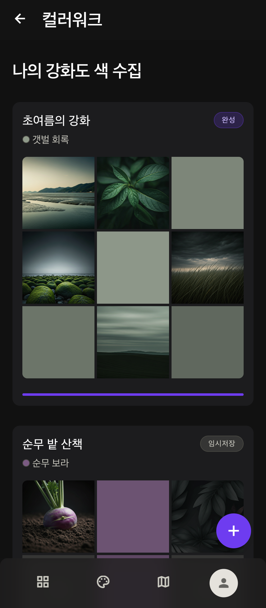
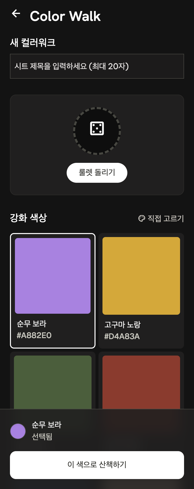
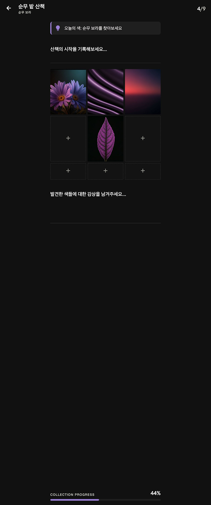
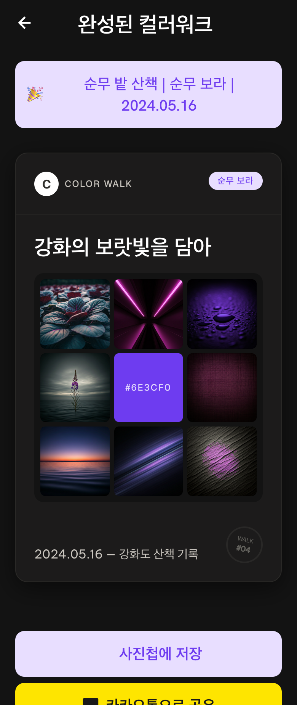

# Color Walk — 화면별 구현 체크리스트 (초안)

> **용도:** 화면 단위로 구현·QA할 때 펼쳐 보는 **개발 전용** 문서. 비주얼·카피·토큰은 [`FIGMA_UI_DESIGN.md`](./FIGMA_UI_DESIGN.md)를 단일 기준으로 하고, 본 문서는 **동작·상태·데이터·수용 기준**에 집중합니다.  
> **연계:** [개발 계획(플랜)](./plan.md) · [FIGMA_UI_DESIGN.md](./FIGMA_UI_DESIGN.md)

### 참고 캡처 (저장소 고정)

경로: [`docs/reference/screenshots/`](./reference/screenshots/) — 상세는 [`screenshots/README.md`](./reference/screenshots/README.md).

| 화면 | 파일 (repo 기준 경로) | 미리보기 |
|------|------------------------|----------|
| **S01** 아카이브 | [`reference/screenshots/archive-list.png`](./reference/screenshots/archive-list.png) |  |
| **S02** 테마 | [`reference/screenshots/theme-new-sheet.png`](./reference/screenshots/theme-new-sheet.png) |  |
| **S03** walk | [`reference/screenshots/walk-grid.png`](./reference/screenshots/walk-grid.png) |  |
| **S04** view | [`reference/screenshots/view-complete.png`](./reference/screenshots/view-complete.png) |  |

원본 `screen1.png` ~ `screen4.png`는 **S01 → S04 순**으로 위 파일명에 맞춰 이 폴더로 이동·변경함.

---

## 공통 (전 화면)

| 항목 | 구현 요약 |
|------|-----------|
| `step` | `archive` \| `theme` \| `walk` \| `view` + `activeSheetId` + 모달 플래그 |
| 레이아웃 | `max-w-md` · 좌우 **20px** · safe-area · 세로만 |
| 토큰 | `FIGMA_UI_DESIGN.md` §3 — 배경 `#131313`, surface 티어, `--theme-color` 동적 |
| 그리드 gap | **6px** (3×3 본 그리드·카드 미니 그리드 동일 원칙) |
| 셀 radius | **4px** (DESIGN.md Collection Swatches) |
| BottomNav | **MVP 없음** — 하단 4탭 미사용(확정 2026-05-16) |
| 접근성 | 터치 타겟 ≥44px, 아이콘-only는 `aria-label`, 스와치+텍스트 병행 |
| 폰트 | **Pretendard**, **Noto Sans KR** (`font-family` 스택, CDN·`@font-face`는 구현 시 한 곳에서만) |

**공통 이벤트**

- 뒤로가기: OS/브라우저와 충돌 시 앱 내 `history` 스택 또는 `step`만 처리(구현 시 단일 정책).
- 오프라인(Phase 4): 공유·카카오 비활성 + 배너 카피는 `FIGMA_UI_DESIGN.md` §9.

---

## NAV — 하단 내비게이션 (`00_BottomNav`)

| 항목 | 내용 |
|------|------|
| **MVP** | **미구현** — 하단 탭 불필요(확정). 전환은 FAB·카드·화면별 AppBar ←. |
| **향후** | v2에서 `BottomNav` 검토 시 FIGMA §4.1. |

---

## S01 — 아카이브 목록 (`01_Archive_List`)

| 항목 | 내용 |
|------|------|
| **FIGMA** | §6 S01 |
| **`step`** | `archive` |
| **컴포넌트** | `SheetList`, `SheetCard`, `PageHeader`, `FAB` — **BottomNav 없음** |
| **AppBar** | **← 없음**(앱 진입·루트 화면) |
| **데이터** | `useSheetArchive` → `SheetsIndex` + 각 `sheet-{id}` 메타(최소 필드로 목록 렌더). 미니 3×3은 `cell-*` Blob **lazy** 로드 가능. |
| **카드 1장** | `sheetTitle`, 뱃지, 테마 스와치+`themeLabel`, 미니 3×3, 완성 시 progress hairline · **날짜**: 기본 `completedAt`(완성) / `updatedAt`(임시) 표시 — **S04에서 수정 가능** → 카드·배너 동기화 |
| **탭** | Draft → `walk` + `activeSheetId`. Done → `view` + `activeSheetId`. |
| **FAB** | `step='theme'`, 새 시트 생성 전이므로 `activeSheetId` 초기화(또는 theme 완료 시 생성). |
| **Overflow** | ⋮ → 시트 삭제 → O03 패턴 confirm → `deleteSheet`. |
| **빈 목록** | → **S01-E** |

### S01-E — 아카이브 빈 상태 (`01_Archive_Empty`)

| 항목 | 내용 |
|------|------|
| **FIGMA** | §6 S01-E |
| **UI** | 화면 **중앙** 일러스트(선택) + 안내 **「첫 컬러워크를 시작해 보세요」** — **중앙 Primary CTA 없음** |
| **새 시트** | **FAB `+`만** → `step='theme'` (S01과 동일 FAB, 0건·1건+ 공통) |
| **완료 체크** | [ ] 0건 시에만 중앙 안내 표시 [ ] FAB는 빈 목록에서도 우하 노출 [ ] 중앙에 「새 컬러워크」버튼 없음 |

**S01 수용 기준**

- [ ] 스크롤 목록에서 카드 탭 동작이 Draft/Done에 따라 위와 같음  
- [ ] `updatedAt` 내림차순 정렬  
- [ ] 미니 그리드 gap **6px**

---

## S02 — 새 컬러워크 / 테마 선택 (`02_Theme_Select`)

> **Stitch 캡처(`theme-new-sheet.png`)** 는 2열 색 카드·룰렛 UI 기준 — **구현은 아래 확정 UX**(직접 선택 메인)를 따름.

| 항목 | 내용 |
|------|------|
| **FIGMA** | §6 S02 · §4.3 |
| **`step`** | `theme` |
| **우선순위** | **1** 직접 선택(메인) → **2** 랜덤 선택 → **3** 프리셋 카드(서브·한 단계 접힘) |
| **컴포넌트** | `SheetTitleInput`, **`CustomColorPicker`**(메인), **`ColorRandomButton`**, **`ThemePresetPicker`**(접힘), `ThemeStickyBar`, `AppBar` |
| **로컬 상태** | `draftTitle`, `themeColor`, `themeLabel`, `themeId`(`custom` \| 프리셋 `id`), `isRandomSpinning`, `presetsExpanded` |
| **검증** | `sheetTitle` trim **1~20자 필수**; `themeColor` 유효 + `themeLabel` trim **1자 이상** — 미충족 시 CTA 비활성 |
| **① CustomColorPicker (메인)** | 대형 스와치·`<input type="color">`(또는 커스텀)·**컬러명 입력**; 변경 시 `themeId='custom'`, `themeLabel`/`themeColor` 사용자 값 |
| **② ColorRandomButton** | 「랜덤 선택」— `themes.ts` 프리셋(순무 보라, 고구마 노랑, 약쑥 초록 등)을 **빠르게 순환 표시** 후 **1개 확정** → 해당 프리셋의 `themeId`·`themeLabel`·`themeColor` 반영(스핀 중 CTA 비활성 권장) |
| **③ ThemePresetPicker (서브)** | 기본 **접힘**(disclosure: 「프리셋에서 고르기」 등); 펼치면 2열 카드(스와치+이름+HEX), 탭 시 프리셋 `id`·라벨·hex — **메인 화면에 카드 그리드 상시 노출 없음** |
| **StickyBar** | 현재 스와치+`themeLabel`+「선택됨」+ **흰색** 「이 색으로 산책하기」 |
| **CTA** | `createSheet({ sheetTitle, themeId, themeLabel, themeColor })` → `walk` |

**S02 수용 기준**

- [ ] 첫 화면에 **직접 선택** 블록만 상시 노출(2열 프리셋 그리드 없음)  
- [ ] 랜덤 선택 후 StickyBar·직접 선택 필드와 값 일치  
- [ ] 프리셋 영역 접힘/펼침 동작; 펼쳤을 때만 카드 목록  
- [ ] 제목·색 검증 미충족 시 CTA 비활성  
- [ ] StickyBar 스크롤 시 하단 고정  

---

## S03 — 산책 그리드 (`03_Walk_Grid`)

| 항목 | 내용 |
|------|------|
| **FIGMA** | §6 S03 · §4.4 |
| **`step`** | `walk` |
| **컴포넌트** | `WalkHeader`, `ThemeHintBar`, `WalkJournal`(×2), `DynamicGrid`, `GridCell`, `WalkProgressFooter`, `CaptureSourceSheet`, `CellDetailModal` |
| **데이터** | `useColorWalkSheet(activeSheetId)` — `cells`, `noteStart`, `noteReflection`, `filledCount`, `rows`/`cols` |
| **헤더** | 메인=`sheetTitle`, 서브=`themeLabel`, 우 `n/N` |
| **힌트** | 「오늘의 색: {themeLabel}를 찾아보세요」— `FIGMA` §9 카피 |
| **메모** | 상·하 2필드; **debounce**(예 300ms) 또는 `blur` 시 persist. 엽서 PNG에 넣지 않음(현재 기획). |
| **그리드** | 빈 칸 탭 → **O01**. 채운 칸 탭 → **O02**. 채움 시 연두 체크 오버레이(UXD). |
| **진행** | 하단 `COLLECTION PROGRESS` + `%` + `themeColor` 바 (`filled/total`). |
| **9/9** | `status=completed`, `walkOrdinal` 부여(첫 완성 시), `step='view'`. |
| **다중 사진** | 갤러리에서 여러 장 선택 시 한 번에 순차 채움 (`resolveCellTargets`) |
| **← 목록** | `archive`로; 데이터는 이미 자동 저장 가정. |

**S03 수용 기준**

- [ ] 새로고침 후 동일 시트 복원  
- [ ] 8MB·비이미지 거부 + UXD 안내  
- [ ] `gap` 6px · 셀 `aspect-ratio: 1`  

---

## S04 — 완성 / 엽서 (`04_View_Complete`)

| 항목 | 내용 |
|------|------|
| **FIGMA** | §6 S04 · §8 |
| **`step`** | `view` |
| **컴포넌트** | `CompleteView`, `SummaryBanner`, `PostcardPreview`(또는 `PostcardCard`), `ExportActions` |
| **데이터** | `postcardHeadline` — **view에서 사용자 편집**(저장 후 엽서·공유 반영); 초기값은 `themeLabel` 기반 템플릿 가능 |
| **배너** | 🎉 + `sheetTitle \| themeLabel \| 날짜` — 날짜는 **편집 가능**(기본 `completedAt`) |
| **엽서** | 중앙 HEX+8포토; **메모는 엽서에 미포함**; `WALK #walkOrdinal` |
| **완성 조건** | **9칸 모두** 사진 촬영 필수(중앙 포함); export 시 중앙만 HEX 레이어로 덮음 |
| **버튼** | 사진첩 저장 · 카카오 **#FEE500** · **navigator.share(이미지)** · 「수정」→ `walk` |
| **수정** | `walk` 전환 시 `completed` 유지 여부: 기존 플랜대로 **삭제로 9 미만 시에만** `in_progress`. |

**S04 수용 기준**

- [ ] 완성 카드 재진입 시 동일 레이아웃  
- [ ] `PostcardPreview` DOM이 html2canvas ref로 안정적(폰트 로드 후 캡처 등 과제)  

---

## O01 — 사진 소스 (`Overlay_CaptureSource`)

| 항목 | 내용 |
|------|------|
| **FIGMA** | §6 O01 · §4.5 |
| **트리거** | 빈 `GridCell` 탭, O02 「다시 찍기」 |
| **UI** | Bottom sheet, 핸들, 카메라 / 갤러리 행, 닫기 |
| **구현** | 숨김 `input`×2 — 카메라 1장 / 갤러리 `multiple`, 선택 직후 시트 닫기 |
| **다중** | OS 선택 순서대로 탭 칸→시계방향 빈 칸; 초과 분 경고(앰버), 검증 실패 오류(빨강); 저장 중 `ImportOverlay` |
| **완료 체크** | [x] 선택 후 Blob 반영 [x] `updatedAt` 갱신 [x] 갤러리 다중 선택 |

---

## O02 — 셀 상세 (`Overlay_CellDetail`)

| 항목 | 내용 |
|------|------|
| **FIGMA** | §6 O02 |
| **UI** | 풀스크린·이미지 contain·닫기·「다시 찍기」「삭제」 |
| **삭제** | → O03 또는 인라인 confirm 후 `clearCell` |

---

## O03 — 삭제 확인 (`Overlay_ConfirmDelete`)

| 항목 | 내용 |
|------|------|
| **FIGMA** | §6 O03 · §9 카피 |
| **변종** | 시트 전체 삭제 vs 셀 사진만 삭제 — 문구 분기 |
| **완료** | IndexedDB 키 일괄 제거(시트) 또는 단일 셀 키 제거 |

---

## Phase 매핑 (빠른 참조)

| Phase | 화면·오버레이 |
|-------|----------------|
| 1 | S01, S01-E, S02, S03·S04 **스텁**, O01~O03 UI만 (**BottomNav 제외**) |
| 2 | S01 데이터 연동, S02→생성, S03 카메라·저장, O01~O03 완료, 메모 persist |
| 3 | S04 `PostcardPreview`·html2canvas·Export·Kakao |
| 4 | PWA, 오프라인, manifest `theme_color` |

---

## 데이터 필드 요약 (`ColorWalkSheet`)

구현 시 타입은 플랜의 `src/types/sheet.ts`와 동일하게 유지.

| 필드 | S01 | S02 | S03 | S04 |
|------|-----|-----|-----|-----|
| `sheetTitle` | 표시 | 입력 | 헤더 | 배너 |
| `themeLabel` / `themeColor` / `themeId` | 카드 | 선택 | 힌트·그리드 | 엽서 |
| `noteStart` / `noteReflection` | — | — | 편집 | —(엽서 미포함) |
| `cells` | 미니그리드 | — | 본 그리드 | 8+중앙HEX |
| `filledCount` / `status` | 뱃지·진행 | — | 헤더·바 | — |
| `walkOrdinal` | — | — | 9/9 시 | 배지 |
| `postcardHeadline` | — | — | — | 제목 |
| `completedAt` | 정렬·표시 | — | — | 배너 날짜 |

---

## 오픈 이슈 (구현 전 결정)

**확정 (2026-05-16)**

| 항목 | 결정 |
|------|------|
| S01-E | 중앙 안내만 + FAB |
| S02 제목 | **필수**(1~20자) + 컬러명 필수 |
| 엽서 메모 | **미포함** |
| 엽서 헤드라인 | **view에서 편집** |
| 9/9 | **9칸 모두 촬영** |
| S01 ← | **없음** |
| 하단 탭 | **MVP 없음** |
| 공유 MVP | 저장 + 카카오 + Web Share |
| 카드 날짜 | 기본 완성일(`completedAt`), **S04에서 수정 가능** |

**잔여**

1. 날짜 편집 UI — S04 배너 인라인 vs 별도 필드(구현 시 FIGMA에 맞춤).  
2. `themes.ts` 최종 목록·**약쑥 초록** HEX 단일 원본 확정.

---

## 변경 이력

| 날짜 | 내용 |
|------|------|
| 2026-05-16 | v0.1 초안 — FIGMA_UI_DESIGN + 개발 플랜 기준 화면별 체크리스트 |
| 2026-05-16 | S02 색 선택 UX — 직접(컬러+이름) 메인, 랜덤 선택, 프리셋 카드 접힘 서브 |

---

*초안이므로 구현 중 발견한 차이는 본 문서와 `FIGMA_UI_DESIGN.md`·플랜 중 한 곳에 반영해 단일 진실을 유지합니다.*
