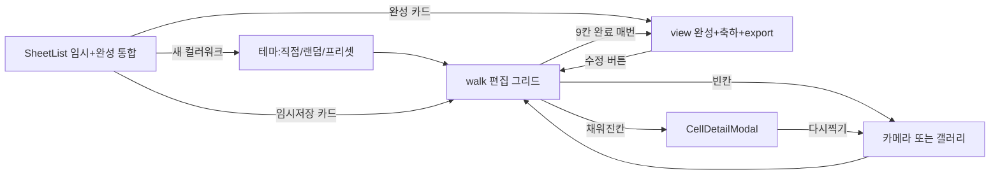
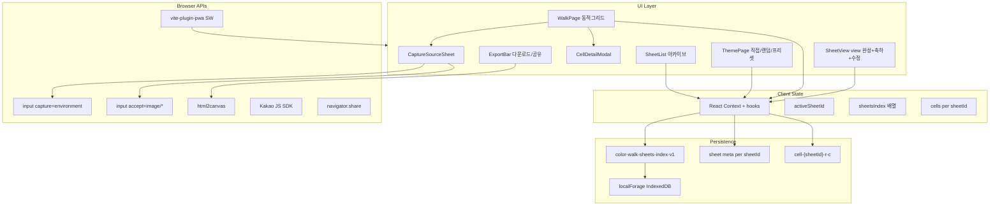

# Color Walk 개발 계획

> **연계:** [`FIGMA_UI_DESIGN.md`](./FIGMA_UI_DESIGN.md) · [`PAGE_IMPLEMENTATION.md`](./PAGE_IMPLEMENTATION.md)

## 현재 상태

- **MVP Phase 1~4 구현 완료** (React 19·Vite·Tailwind·IndexedDB·PWA·엽서 export).
- UI·동작 기준: [`FIGMA_UI_DESIGN.md`](./FIGMA_UI_DESIGN.md) (v2.3), 화면별 체크리스트 [`PAGE_IMPLEMENTATION.md`](./PAGE_IMPLEMENTATION.md).
- 전제: **Kakao Developers 앱 키** (`.env`), Stitch 캡처 [`reference/screenshots/`](./reference/screenshots/).

---

## Stitch / Nocturnal 디자인 정합 (UI 소스 오브 트루스)

실제 레이아웃·색·타이포는 아래 순으로 맞춤.

1. **Stitch 스크린 캡처** — 저장소 [`./reference/screenshots/`](./reference/screenshots/) (`archive-list`·`theme-new-sheet`·`walk-grid`·`view-complete` = S01~S04)  
2. **토큰 YAML** 로컬 Stitch `nocturnal_wanderer/DESIGN.md` (개발자 머신) — *Nocturnal Wanderer*: `background` `#131313`, surface 티어, **`gutter-grid` 6px**, **`margin-main` 20px**, Primary CTA **`#ffffff`**. **타이포는 웹에서 Pretendard + Noto Sans KR 단일 스택**(DESIGN 영문 폰트명은 참고만).  
3. [`./FIGMA_UI_DESIGN.md`](./FIGMA_UI_DESIGN.md) — 컴포넌트 명세·§4·§6·§9 카피.  
4. [`./PAGE_IMPLEMENTATION.md`](./PAGE_IMPLEMENTATION.md) — 화면별 구현·수용 기준(본 플랜 §화면별 구성요소와 동기화).

**개발 UI 방향 변경 (기존 대비)**

| 영역 | 이전(기획) | 현재(Stitch+DESIGN.md) |
|------|-------------|-------------------------|
| 컬러 모드 | 라이트 1안 | **다크 우선** + 동적 테마 액센트 |
| 앱 목록 헤더 | 앱바만 | 앱바 + **「나의 강화도 색 수집」** 대제목 |
| 시트 카드 | 좌 단일 썸네일 | **인라인 미니 3×3**(빈칸=테마 솔리드, 채움=포토)·gap **6px** |
| 새 시트 | 테마만 | **`sheetTitle`** + **강화 색상**: ① **직접**(피커+컬러명) ② **랜덤 선택** ③ **프리셋 카드**(접힘) |
| 테마 선택 UI | 카드 그리드 메인 | **직접 선택 메인**; 랜덤 버튼; 프리셋은 **한 단계 접힘**; 하단 Sticky+화이트 CTA |
| walk 헤더 | 테마중심 | **시트 제목** 메인 + 테마 부제 + 우 `n/N` |
| walk 본문 | 그리드만 | 힌트 배너(전구)·그리드·**메모 필드 2개**(시작 소감/색 감상, IndexedDB 문자열 저장) |
| walk 하단 | 암시적 진행만 | **`themeColor`** 얇은 **progress bar + %**(선택) |
| 바텀 내비 | Stitch 4탭 | **MVP 없음** — FAB·카드·AppBar ← 로만 이동 |
| 엽서(Postcard) | 9칸 포토 단순 레이아웃 | **중앙 1셀만 `themeColor`+HEX** 오버레이, **주변 8셀 사용자 사진**(9칸 촬영은 유지 · export 레이어만 다름 · §Phase 3) |
| 카카오 공유 버튼 | 단순 버튼 | 디자인: **브랜드 노랑** 구역 |
| 순무 보라 등 HEX | `#7B61A8` 등 코드 초안 | **캡처·Figma 원본 HEX와 동기화**(예 순무 `#A882E0` 등) |

---

## UX 확정 사항 (현재 결정 — 추후 변경 가능)

| # | 항목 | 결정 |
|---|------|------|
| 1 | **채워진 칸 탭** | 사진 **크게 보기** 모달(`CellDetailModal`) → 「다시 찍기」「삭제」 |
| 2 | **저장·목록** | 촬영·이탈 시 **즉시 임시저장**(IndexedDB). **진행 중·완성 시트를 한 페이지**(`archive`)에 모두 표시 |
| 3 | **다중 시트** | 여러 장 생성·보관·이어하기 (아래 다중 시트 설계) |
| 4 | **사진 넣기** | **카메라·갤러리 둘 다** 선택 가능(빈 칸·다시 찍기 시 동일) |
| 5 | **완성 UX** | **별도 celebrate 단계 없음.** 9/9가 되면 항상 **`view`(완성 화면)** — 축하 UI + 완성형 그리드 + 저장·공유. 삭제 후 다시 9/9여도 **매번** 동일 |
| 6 | **테마 색** | **1순위** 직접: 컬러 피커 + **컬러명**(`themeId='custom'`). **2순위** 「랜덤 선택」: `themes.ts` 프리셋 순환 후 1개. **3순위** 프리셋 카드(접힘). 2열 카드 메인 UI **없음** |
| 7 | **완성 후 칸 삭제** | 9칸 미만 → **`in_progress`**. 다시 9/9 → **`view` + 축하 UI** (항상) |
| 8 | **편집 복귀** | `view`에 **「수정」** 버튼 → `walk`(편집 그리드). 완성 카드·9/9 재진입은 `view` |
| 9 | **view에서 칸 탭** | `walk`와 동일 — **크게 보기·다시 찍기·삭제** (`CellDetailModal`) |
| 10 | **0/9 시트** | 목록에 **표시** — 「임시저장 0/9」, 이어하기 가능 |
| 11 | **시트 제목** | `sheetTitle`, **최대 20자**, trim, 허용 문자 정책(이모지 허용 여부는 구현 시 단순하게) — 목록 카드·walk·완성 배너 표시 |
| 12 | **산책 메모** | `noteStart`, `noteReflection` (멀티라인 문자열), **자동 임시저장** |
| 13 | **아카이브 헤더 copy** | 페이지 대제목 「**나의 강화도 색 수집**」 |
| 14 | **바텀 네비게이션** | **MVP 미구현**(확정). v2에서 4탭 검토 |
| 17 | **시트 제목·색** | 제목 **1~20자 필수** + `themeLabel` 1자 이상 — CTA 비활성 |
| 18 | **엽서** | `postcardHeadline` **view 편집**; 메모 **엽서 미포함**; 9칸 **전부 촬영** |
| 19 | **날짜** | 카드·배너 기본 `completedAt`; **S04에서 수정 가능** |
| 20 | **공유 MVP** | 저장 + 카카오 + `navigator.share`(이미지) |
| 21 | **S01 AppBar** | **← 없음**(루트) |
| 15 | **프리셋 카드** | 접힌 영역 안에서만: 스와치+이름+**HEX**(12px Medium). 랜덤 풀·직접 선택과 동일 `themes.ts` |
| 16 | **엽서 내보내기** | `PostcardPreview`: **중앙 1셀**에 `themeColor`+HEX, **8셀** 사용자 사진(Stitch). `walkIndex` 또는 `walkNumber`로 「WALK #04」 배지(완성 순서 기반 계산) |

---

## 사용자 시나리오 (다중 시트)

**핵심:** 여러 컬러워크 시트를 만들고, **임시저장(진행 중)** 과 **완성** 이 한 목록에 모이며, 언제든 다시 열 수 있음.



| 시나리오 | 사용자 행동 | 앱 동작 |
|----------|-------------|---------|
| 첫 방문 | 앱 실행 | `archive` — 임시저장·완성 통합 목록(비어 있으면 CTA) |
| 새 시트 | FAB → 제목·색(직접/랜덤/프리셋) 확정 | `sheetTitle`+`theme*` → `createSheet` → `walk` |
| 임시저장 | 그리드에서 사진 추가 후 ← 목록 | **자동 저장**된 채 목록에 「임시저장」 뱃지 |
| 이어하기 | 임시저장 카드 탭 | `walk`로 복원 |
| 빈 칸 | 칸 탭 | 「카메라로 찍기」「갤러리에서 고르기」 액션 시트 |
| 채워진 칸 | 칸 탭 | **크게 보기** → 다시 찍기 / 삭제 |
| 완성 | 9번째 칸 채움(또는 삭제 후 재완성) | **`view`**: 축하 배너/카피 + 완성형 그리드 + export, `completed` 설정 |
| 편집 복귀 | `view`에서 「수정」 | `walk` 편집 화면 |
| 완성 후 삭제 | `view`/`walk`에서 칸 삭제 → 9칸 미만 | `in_progress`, 목록 「임시저장」 |
| 0/9 시트 | 산책 시작만 하고 사진 없음 | 목록 「임시저장 0/9」·`walk` |
| 다시 보기 | 완성 카드 탭 | `view`(축하 UI 포함) |
| 여러 장 | 완성 후 목록 → 새 컬러워크 | 시트 누적 |
| 시트 삭제 | 카드 ⋮ 또는 스와이프 | confirm 후 저장소 일괄 삭제 |

**화면 단계 (`step`)**

- `archive` — **임시저장 + 완성** 통합 목록 (앱 진입 기본)
- `theme` — 직접(피커+컬러명)·랜덤 선택·접힘 프리셋 카드
- `walk` — N×M **편집** 그리드(미완·수정 모드)
- `view` — **완성 화면**: 축하 UI + 완성형 레이아웃 + 「수정」+ export (`celebrate` 단계 **통합**, 별도 step 없음)

오버레이(전체 화면 모달): `CellDetailModal`, `CaptureSourceSheet`(카메라/갤러리 선택)

라우팅은 `react-router-dom` 없이 `step` + `activeSheetId` + 모달 상태로 관리합니다.

---

## 화면 ID ↔ Phase 매핑

[`PAGE_IMPLEMENTATION.md`](./PAGE_IMPLEMENTATION.md) §Phase 매핑과 동일.

| Phase | 화면·오버레이 | 구현 깊이 |
|-------|----------------|-----------|
| **1** | **S01**, **S01-E**, **S02**, **S03·S04 스텁**, **O01~O03 UI 스텁** (BottomNav 없음) | 레이아웃·토큰·카피·상호작용 골격 |
| **2** | S01 데이터, S02→`createSheet`, S03 카메라·저장·메모, O01~O03 동작, **SheetCard ⋮** | IndexedDB·실플로우 |
| **3** | **S04** `PostcardPreview`·html2canvas·Export·Kakao | 엽서·공유 |
| **4** | PWA·오프라인·manifest | 배포 품질 |

---

## 화면별 구성요소 (구현 체크리스트)

상세 수용 기준·데이터 필드는 **PAGE**를 따르고, 여기는 플랜 Phase 작업용 **UI 구성요소 목록**이다.

### NAV — 하단 바

**MVP 제외**(확정). Stitch 4탭은 v2·FIGMA §4.1 참고.

### S01 — 아카이브 목록 (`01_Archive_List`, `step=archive`)

| 구역 | 구성 |
|------|------|
| **AppBar** | **← 없음**, 앱명 **「컬러워크」** |
| **PageHeader** | 대제목 **「나의 강화도 색 수집」** (`headline-lg-mobile` 근사) |
| **SheetList** | `SheetCard` 스크롤 목록, `updatedAt` 내림차순 |
| **SheetCard** | `sheetTitle` · 뱃지(임시저장\|완성) · 테마 ●+`themeLabel` · **미니 3×3**(gap 6px, 빈칸=`themeColor` 솔리드) · 완성 시 하단 `themeColor` hairline · **⋮ Overflow**(Phase 2) · 날짜(선택, FIGMA) |
| **FAB** | 우하 `+`, a11y 「새 컬러워크」→ `step='theme'` |
| **하단** | BottomNav **없음** |
| **탭 동작** | Draft 카드 → `walk` · Done 카드 → `view` |

### S01-E — 아카이브 빈 상태 (`01_Archive_Empty`)

| 구역 | 구성 |
|------|------|
| **EmptyArchive** | 일러스트(선택) + 중앙 안내 **「첫 컬러워크를 시작해 보세요」** — **중앙 버튼 없음** |
| **새 시트** | **FAB `+`만** (0건·1건+ 동일, 우하) → `theme` |

### S02 — 새 컬러워크 (`02_Theme_Select`, `step=theme`)

**우선순위:** ① 직접 선택 → ② 랜덤 선택 → ③ 프리셋(접힘). *(Stitch 2열·룰렛 캡처는 레거시.)*

| 구역 | 구성 |
|------|------|
| **AppBar** | ← + 「새 컬러워크」 |
| **SheetTitleInput** | 최대 20자 |
| **SectionHeader** | 「강화 색상」 |
| **CustomColorPicker** | **메인** — 스와치·`<input type="color">`·**컬러명** → `themeId='custom'` |
| **ColorRandomButton** | 「랜덤 선택」— `themes.ts` 프리셋 **빠른 순환** → 1개 확정 → 해당 `themeId`·label·hex |
| **ThemePresetPicker** | **접힘** 「프리셋에서 고르기」; 펼치면 2열 카드(HEX·흰 보더 선택) |
| **ThemeStickyBar** | 스와치+`themeLabel`+「선택됨」+ **「이 색으로 산책하기」** |
| **CTA** | `themeLabel` trim ≥1 · `createSheet` → `walk` |

### S03 — 산책 그리드 (`03_Walk_Grid`, `step=walk`)

| 구역 | 구성 |
|------|------|
| **AppBar / WalkHeader** | ← · 메인=`sheetTitle` · 서브=`themeLabel` · 우 `n/N` |
| **ThemeHintBar** | 전구 + 「오늘의 색: {테마명}를 찾아보세요」 |
| **WalkJournal** | 상·하 멀티라인 2개(placeholder §FIGMA §9) |
| **DynamicGrid** | 3×3, gap 6px, `GridCell` Empty/Filled(+연두 체크 UXD) |
| **WalkProgressFooter** | `COLLECTION PROGRESS` + `%` + `themeColor` 바 |
| **← 목록** | `archive`(자동 저장 가정) |
| **오버레이** | 빈 칸→**O01** · 채운 칸→**O02** |

### S04 — 완성 (`04_View_Complete`, `step=view`)

| 구역 | 구성 |
|------|------|
| **ViewAppBar** | 「완성된 컬러워크」 |
| **SummaryBanner** | 🎉 + `sheetTitle \| themeLabel \| 날짜` |
| **PostcardPreview** | 브랜딩·`postcardHeadline`·3×3(중앙 HEX+8포토)·`WALK #walkOrdinal` |
| **ExportActions** | 사진첩 저장 · 카카오 `#FEE500` · (선택) 이미지 공유 |
| **Button/Edit** | 「수정」→ `walk` |
| **9/9** | 별도 celebrate step 없음 — 본 화면에 축하 UI 통합 |

### O01 — 사진 소스 (`Overlay_CaptureSource`)

| 구역 | 구성 |
|------|------|
| UI | Bottom sheet + 핸들, 카메라 / 갤러리 행 |
| 구현 | 숨김 `input`×2 (`capture=environment` / 없음) |

### O02 — 셀 상세 (`Overlay_CellDetail`)

| 구역 | 구성 |
|------|------|
| UI | 풀스크린 이미지, 닫기, 「다시 찍기」「삭제」 |
| 삭제 | → **O03** 또는 인라인 confirm |

### O03 — 삭제 확인 (`Overlay_ConfirmDelete`)

| 구역 | 구성 |
|------|------|
| 변종 | 시트 전체 vs 셀 사진 — 문구 분기 |
| 트리거 | SheetCard **⋮**, O02 삭제 |

---

## 아키텍처 개요



---

## 프로젝트 구조 (목표)

```
color-walk/
├── AGENTS.md                 # 작업 이력 (HISTORY 지침)
├── .env.example              # VITE_KAKAO_JS_KEY
├── public/
│   ├── icons/                # PWA 192/512
│   └── manifest.webmanifest  # (vite-plugin-pwa가 생성 가능)
├── src/
│   ├── main.tsx
│   ├── App.tsx
│   ├── index.css             # Tailwind @layer
│   ├── config/
│   │   └── grid.ts           # DEFAULT_ROWS=3, DEFAULT_COLS=3
│   ├── data/
│   │   └── themes.ts         # 프리셋: label + hex swatch
│   ├── types/
│   │   └── sheet.ts          # ColorWalkSheet, SheetIndex, SheetStatus
│   ├── lib/
│   │   ├── storage.ts        # 인덱스·시트 CRUD·Blob 키 헬퍼
│   │   ├── sheetId.ts        # crypto.randomUUID()
│   │   ├── exportImage.ts    # html2canvas + download
│   │   └── kakao.ts          # SDK init + share helpers
│   ├── hooks/
│   │   ├── useSheetArchive.ts  # 목록 로드·정렬·삭제
│   │   ├── useColorWalkSheet.ts # 단일 시트 로드/셀 저장/완료
│   │   └── useGridCompletion.ts
│   └── components/
│       ├── layout/MobileShell.tsx
│       ├── layout/AppBar.tsx            # ← + 제목 (S01~S04·theme)
│       ├── layout/PageHeader.tsx        # S01 대제목
│       # layout/BottomNav.tsx — v2 (MVP 제외)
│       ├── archive/SheetList.tsx        # S01
│       ├── archive/SheetCard.tsx        # 미니 3×3 + 뱃지 + ⋮
│       ├── archive/EmptyArchive.tsx     # S01-E
│       ├── archive/FAB.tsx              # 새 컬러워크
│       ├── theme/SheetTitleInput.tsx
│       ├── theme/ThemeStickyBar.tsx   # 하단 선택 요약 + CTA
│       ├── walk/WalkHeader.tsx        # 시트명·테마·n/N
│       ├── walk/WalkJournal.tsx
│       ├── walk/WalkProgressFooter.tsx
│       ├── walk/ThemeHintBar.tsx      # 전구 힌트 (또는 WalkPage 내 섹션)
│       ├── theme/CustomColorPicker.tsx   # 메인: color + 컬러명
│       ├── theme/ColorRandomButton.tsx   # 랜덤 순환·확정
│       ├── theme/ThemePresetPicker.tsx   # 접힘 + 2열 카드
│       ├── grid/DynamicGrid.tsx
│       ├── grid/GridCell.tsx
│       ├── grid/CellDetailModal.tsx   # 크게보기·다시찍기·삭제
│       ├── grid/CaptureSourceSheet.tsx # 카메라 | 갤러리
│       ├── complete/CompleteView.tsx    # S04 셸
│       ├── complete/SummaryBanner.tsx
│       ├── complete/PostcardPreview.tsx # Phase 3 ref 대상
│       ├── export/ExportActions.tsx
│       └── ui/ConfirmDeleteDialog.tsx   # O03
├── vite.config.ts
├── tailwind.config.js
└── package.json
```

---

## 공통 기술 결정

| 항목 | 결정 |
|------|------|
| 언어 | TypeScript (`react-ts` 템플릿) |
| 그리드 크기 | [`src/config/grid.ts`](src/config/grid.ts)의 `rows`, `cols` 상수만 변경하면 2×2, 4×4 확장 |
| 이미지 저장 | **시트 단위** IndexedDB — 인덱스 `color-walk-sheets-index-v1` + 시트별 메타·셀 Blob |
| 시트 식별 | `sheetId` = `crypto.randomUUID()`, 생성 시 인덱스 맨 앞 추가 (`updatedAt` 내림차순) |
| 썸네일 | 첫 채워진 칸 Blob을 `thumb-{sheetId}`로 복사 저장(목록 카드용, 선택) |
| 시트 상태 | `in_progress` = 목록 「임시저장」, `completed` = 「완성」 — **한 페이지**에 혼합 표시, `updatedAt` 내림차순 |
| 완성 흐름 | `filledCount === 9` → `view` + 축하 UI + `completed` (매번, 재완성 포함). `view` 「수정」→ `walk` |
| 완성 후 편집 | `view`/`walk` 동일 `CellDetailModal`. 삭제로 9칸 미만 시 `in_progress` 복귀 |
| 0/9 시트 | 「산책하기」 직후부터 목록에 임시저장으로 표시 |
| 테마 색 | `themeLabel` + `themeColor`(hex). 프리셋 `themeId` 또는 커스텀 `themeId: 'custom'` |
| 사진 소스 | 카메라용·갤러리용 **file input 2개** — `capture="environment"` 유무로 분기, 빈 칸/다시찍기 공통 |
| 셀 상호작용 | 빈 칸 → 소스 선택 → 촬영/선택. 채워진 칸 → `CellDetailModal`(확대·다시찍기·삭제) |
| Blob 처리 | 셀별 `Blob` 저장, UI는 `URL.createObjectURL` (언마운트 시 `revokeObjectURL`) |
| 고화질 엽서 | `html2canvas` `scale: 2~3`, `useCORS: true`, JPEG `quality: 0.92` |
| Kakao 공유 | **하이브리드**: Kakao Link(텍스트+앱 URL) + `navigator.share`로 이미지 파일 공유(Android/iOS 지원 시) |
| UI 토큰 | `DESIGN.md` YAML → CSS 변수(`:root`)·Tailwind extend. **배경 `#131313`**, surface 티어, **그리드 gap 6px**, **margin 20px**, 메인 CTA **흰색 배경**(+ `on-primary` 텍스트색) |
| 타이포 웹 | **`Pretendard`, `Noto Sans KR`, sans-serif`** — `index.html`/글로벌 CSS 한 곳 로드 · 역할별 크기·웨이트는 FIGMA §3.2 |
| 카드 미리보그 | 목록 `SheetCard`: **미니 3×3** — 빈 칸 `themeColor` 솔리드, 채움 셀은 썸네일(또는 objectURL) |

### Kakao 공유 제약 (계획에 반영)

Kakao Feed 템플릿의 `imageUrl`은 **공개 HTTPS URL**이 필요합니다. 백엔드가 없으므로:

- **Kakao SDK**: 앱 소개 링크 + 테마명/완성 메시지 공유 (`Kakao.Share.sendDefault`)
- **이미지 파일 공유**: `navigator.share({ files: [postcardFile] })` 우선, 미지원 시 다운로드 후 수동 공유 안내 토스트

Phase 3에서 위 두 경로를 모두 구현합니다.

### 테마 프리셋 (초안 — [`src/data/themes.ts`](src/data/themes.ts))

강화도 로컬 컬러 네이밍 예시 (6~8개, **랜덤 풀 + 접힘 프리셋** 공용):

- 순무 보라 — `#A882E0` 등 디자인 hex 우선
- 고구마 노랑 — `#D4A83A`
- 약쑥 초록 — (hex `themes.ts`·FIGMA와 동기화)
- 갯벌 회록 `#6B8F7A`
- 조개 살구 `#F2C4A0`
- 갈대 초록 `#9CB86E`
- 바다 먹빛 `#4A6FA5`
- 노을 주황 `#E07A4F`
- 모래 베이지 `#D4C4A8`

각 프리셋: `id`, `label`, `color`(hex).

**직접 선택 (`CustomColorPicker`)** — 메인 UI

- `<input type="color">` + **컬러명** 텍스트 필드
- `themeId: 'custom'`, `themeLabel`, `themeColor` 사용자 입력

**랜덤 선택 (`ColorRandomButton`)**

- `themes.ts` 배열을 interval로 순환 표시(스와치·라벨) → 종료 시 **랜덤 1개** 확정 → 해당 프리셋 `id`·`label`·`color` 반영

**프리셋 카드 (`ThemePresetPicker`)**

- 기본 `presetsExpanded=false`; disclosure로 펼침
- 2열 카드 그리드는 **펼쳤을 때만**

---

## Phase 1: 뼈대 + 동적 그리드 + 테마(직접/랜덤/프리셋) UI

**목표:** 빌드 가능한 모바일 레이아웃, S02 색 선택 UX, 변수 기반 N×M 그리드(빈 칸 UI만).

### 작업 목록

1. **프로젝트 초기화**
   - `npm create vite@latest . -- --template react-ts`
   - Tailwind CSS v4 또는 v3 (Vite 공식 가이드 따라 설치)
   - `postcss`, `autoprefixer`, `tailwind.config` — `content: ['./index.html', './src/**/*.{ts,tsx}']`
   - [`AGENTS.md`](AGENTS.md) 생성 및 Phase별 한 줄 이력 기록 시작

2. **MobileShell·DESIGN·폰트**
   - 다크 배경·서페이스·`outline`을 DESIGN 토큰 → `index.css` / Tailwind `@theme`
   - **Pretendard + Noto Sans KR** CDN 또는 npm, `body` 단일 `font-family`
3. **S01 아카이브 + S01-E** (BottomNav 없음)
   - `AppBar`: 「컬러워크」만 (**← 없음**)
   - `PageHeader`: 「나의 강화도 색 수집」
   - `SheetList` + `SheetCard`(목업 1~2장): 미니 3×3(gap **6px**), 뱃지, 테마 라인, progress hairline(완성 샘플)
   - `FAB` → `step='theme'`
   - **`EmptyArchive`**: 0건 시 중앙 안내 문구만; **FAB `+`는 항상** 우하 노출

4. **S02 테마**
   - `AppBar`, `SheetTitleInput`, **`CustomColorPicker`**(피커+컬러명), **`ColorRandomButton`**(순환 UI 스텁), **`ThemePresetPicker`**(접힘+카드), `ThemeStickyBar`

5. **S03·S04 스텁 + O01~O03 UI 스텁**
   - S03: `WalkHeader`, `ThemeHintBar`, `WalkJournal`×2, `DynamicGrid`+`GridCell`, `WalkProgressFooter`
   - S04: `CompleteView`, `SummaryBanner`, `PostcardPreview` 플레이스홀더, `ExportActions` 버튼만
   - **O01** `CaptureSourceSheet`, **O02** `CellDetailModal`, **O03** `ConfirmDeleteDialog` — 열기/닫기만, Phase 2에서 persist

6. **상태 골격**
   - `step: 'archive' | 'theme' | 'walk' | 'view'`
   - `config/grid.ts`: `DEFAULT_ROWS = 3`, `DEFAULT_COLS = 3`

### Phase 1 완료 기준

- **S01**(AppBar+PageHeader+카드+FAB, 탭 없음) · **S01-E** · **S02** · **S03/S04 스텁** · **O01~O03** UI 스텁
- 통합 목록(목업) → FAB → 테마 → `walk` → (스텁) `view` · 「수정」→ `walk`
- `grid.ts` 변경 시 N×M 즉시 반영 · PAGE §S01~S04 수용 기준 중 **UI 항목** 체크 가능

---

## Phase 2: 카메라 + 다중 시트 IndexedDB

**목표:** 시트별 촬영·자동 저장, 아카이브 목록·이어하기·다시 보기·삭제.

### 작업 목록

1. **카메라·갤러리**
   - `CaptureSourceSheet`: 「카메라로 찍기」→ `input[capture=environment]`, 「갤러리」→ `input`만(`capture` 없음)
   - 빈 칸 탭·`CellDetailModal` 「다시 찍기」 동일 플로우
   - `File` → `Blob` 검증 (`image/*`, max 8MB), 저장 즉시 **임시저장** 반영

2. **셀 상세 (O02 `CellDetailModal`) + O03**
   - 채워진 칸: 전체 화면에 사진 확대
   - 「다시 찍기」→ **O01** → 덮어쓰기 저장
   - 「삭제」→ **O03** confirm(셀 변종) → Blob·메타 제거, `filledCount` 감소

3. **localForage 스키마** ([`src/types/sheet.ts`](src/types/sheet.ts))

```ts
type SheetStatus = 'in_progress' | 'completed'; // UI: 임시저장 | 완성

interface ColorWalkSheet {
  version: 1;
  id: string;
  sheetTitle: string;           // 최대 20자, trim
  themeId: string;              // preset id | 'custom'
  themeLabel: string;
  themeColor: string;           // "#RRGGBB"
  noteStart?: string;           // walk 상단 소감
  noteReflection?: string;       // 하단 소감
  postcardHeadline?: string;     // 엽서 큰 헤드(없으면 theme 기반 템플릿)
  walkOrdinal?: number;          // 완성 순으로 부여된 번호(WALK #04) 또는 completed 시 계산해 저장
  rows: number;
  cols: number;
  status: SheetStatus;
  filledCount: number;
  cells: Record<string, { blobKey: string }>; // 키 "r-c"; 중앙(1-1)도 일반 저장(export 시 HEX 오버레이만)
  thumbnailKey?: string;
  createdAt: string;
  updatedAt: string;
  completedAt?: string;
}

// 인덱스: 시트 id 목록 + 최소 메타(목록 렌더용, 전체는 sheet-{id} 키)
interface SheetsIndex {
  version: 1;
  sheetIds: string[];      // updatedAt 내림차순 유지
}
```

   - 저장 키: `color-walk-sheets-index-v1`, `sheet-{sheetId}`, `cell-{sheetId}-{r}-{c}`, `thumb-{sheetId}`
   - **새 시트:** 테마 확정 시 `createSheet()` → 인덱스 prepend → `walk` 진입
   - **셀 저장:** Blob 저장 + `filledCount`/`updatedAt` 갱신 + 첫 셀 시 썸네일 생성

4. **`useSheetArchive` + S01 카드 액션**
   - `listSheets()`: 인덱스 순회, 카드용 메타 로드(미니그리드 Blob **lazy** 가능)
   - **`SheetCard` ⋮ Overflow** → **O03** confirm → `deleteSheet(sheetId)` (메타·cell·thumb 일괄 삭제)
   - 빈 목록 시 **S01-E** 표시

5. **`useColorWalkSheet(sheetId)`**
   - `setCell` / `clearCell`, `setNotes` 등: 즉시 persist
   - 최초로 `status`가 `completed`로 바뀔 때 `walkOrdinal` = 기존 완성 시트 수+1 로 저장(또는 카운터 키)
   - `filledCount === 9` → `view` + `completed`

6. **`CompleteView`**
   - 앱바 「완성된 컬러워크」, 요약 배너(STitch 한 줄)
   - 엽서 헤드라인: `postcardHeadline` 또는 `themeLabel` 기반 자동 문장
   - ExportActions: 사진첩(테마 tinted 버튼)·카카오(#FEE500)·Web Share
   - 「수정」→ `walk`

7. **메모 동기화:** `noteStart`/`noteReflection` 디바운스 저장

8. **상태 되돌림**
   - `clearCell` 등으로 9칸 미만 → `in_progress`; `walkOrdinal`은 유지 또는 정책에 따라 null(과제)
   - 다시 9/9 → `view` + `completed`
   - `archive` 카드: 임시저장 vs 완성 뱃지, 스와치+테마명
   - `walk` 「← 목록」: 임시저장 유지
   - 채움 칸 연두 체크, 촬영 로딩·실패 토스트

### Phase 2 완료 기준

- 카메라·갤러리 모두로 사진 추가, 채워진 칸 확대·다시찍기·삭제
- 이탈·새로고침 후 **통합 목록**에 임시저장·완성 표시, 이어하기 동작
- 9칸 완료 → `view`(축하 포함), 「수정」→ `walk`, 삭제 후 재완성 시 다시 `view`

---

## Phase 3: 엽서 합성 + 다운로드 + Kakao/Web Share

**목표:** html2canvas 고화질 JPEG/PNG, 사진첩 저장, 공유.

### 작업 목록

1. **엽서 컴포넌트** `PostcardPreview` (ref 대상)
   - Stitch 카드 구조: 브랜딩 행·`postcardHeadline`·**3×3** — **중앙 (row=1,col=1)** 셀만 `themeColor` 솔리드 + **대문자 HEX** 렌더; **나머지 8칸**은 사용자 촬영 이미지(해당 `cells` blob)
   - 사용자는 **9칸 모두** 촬영·저장(중앙 포함) — export 시 중앙 레이어가 시각적으로 HEX를 덮음(저장(blob) 불필요 시 정책으로 중앙 촬영 생략은 **비권장**, 일관 규칙 유지 추천)
   - 하단 카피·**WALK #`walkOrdinal`** 배지 원형 텍스트
   - 배경색: 카드 어두운 톤 — html2canvas 캡처용으로 **폰 색 또는 단색** 구분 명시(`backgroundColor`)

2. **`exportImage.ts`**
   - `html2canvas(element, { scale: 3, backgroundColor: 엽서 카드 배경에 맞춤 — 다크 카드면 `#131313`/`#201f1f` 등 DESIGN 토큰 })`
   - `canvas.toBlob('image/jpeg', 0.92)` → `downloadPostcard(filename)`
   - iOS Safari: `<a download>` 제한 시 `navigator.share` 또는 새 탭 blob URL 안내

3. **ExportActions**
   - "사진첩에 저장" 버튼
   - "카카오톡으로 공유" → [`src/lib/kakao.ts`](src/lib/kakao.ts)
     - `Kakao.init(import.meta.env.VITE_KAKAO_JS_KEY)` — `index.html`에 SDK script **또는** dynamic load
     - `sendDefault` feed: title, description, `link.mobileWebUrl` = `VITE_APP_URL`
   - "이미지 공유" → `navigator.share` with `File` (지원 여부 `if (navigator.canShare?.({ files }))`)

4. **`.env.example`**

```
VITE_KAKAO_JS_KEY=your_javascript_key
VITE_APP_URL=https://your-deployed-domain.com
```

5. **HTTPS 로컬 테스트**
   - 카메라·PWA 테스트: `vite --host` + mkcert 또는 배포 스테이징 URL 권장 (계획 문서화만)

### Phase 3 완료 기준

- 완성 시트 `view` 및 `walk` 완료 직후 엽서 JPEG 다운로드
- 아카이브에서 예전 완성 시트를 열어 **다시** 저장·공유 가능
- Kakao 공유 창 호출 + (가능 기기에서) 이미지 파일 공유

---

## Phase 4: PWA + 마무리

**목표:** 홈 화면 추가, 오프라인 앱 셸, 품질 마무리.

### 작업 목록

1. **`vite-plugin-pwa`**
   - `registerType: 'autoUpdate'`
   - `manifest`: `name`, `short_name`, `theme_color`(테마 accent), `display: 'standalone'`, `orientation: 'portrait'`
   - `workbox`: `globPatterns` 정적 자산 precache; **IndexedDB 데이터는 SW가 덮어쓰지 않음** (별도 저장소)

2. **아이콘**
   - `public/icons/icon-192.png`, `icon-512.png` — 미니멀 컬러 원형 로고 (자체 생성)

3. **오프라인 UX**
   - 오프라인 배너: "인터넷 없이도 촬영·저장 가능, 공유는 연결 시 이용"
   - Kakao SDK는 온라인 필요 → 오프라인 시 공유 버튼 비활성 + 안내

4. **마무리 체크**
   - Lighthouse PWA / 모바일 접근성 기본 점검
   - `viewport-fit=cover`, `theme-color` meta
   - 한국어 주석: 훅·storage·export·kakao 모듈에 "왜" 중심 간결 주석
   - README: 로컬 실행, env 설정, 빌드·배포(Vercel/Netlify 등 정적 호스팅)

### Phase 4 완료 기준

- 오프라인에서 앱 셸 로드 + **모든 저장 시트** IndexedDB 유지
- "홈 화면에 추가" 후 standalone 실행, 진입 시 아카이브 목록 표시

---

## 의존성 (package.json 예상)

```json
{
  "dependencies": {
    "react": "^19",
    "react-dom": "^19",
    "localforage": "^1.10",
    "html2canvas": "^1.4"
  },
  "devDependencies": {
    "vite": "^6",
    "@vitejs/plugin-react": "^4",
    "typescript": "^5",
    "tailwindcss": "^3",
    "vite-plugin-pwa": "^0.21"
  }
}
```

(Kakao SDK는 npm 패키지 없이 CDN script 로드가 일반적)

---

## 배포·운영

- **호스팅**: 정적 SPA (Vercel / Netlify / GitHub Pages) — HTTPS 필수
- **Kakao Developers**: 플랫폼 Web 도메인에 배포 URL 등록, JavaScript 키 도메인 화이트리스트
- **커밋/PR** (구현 시): 사용자 규칙에 따라 이슈 번호·제목 확인 후 `이슈제목 resolve #번호` 형식

---

## 리스크 및 완화

| 리스크 | 완화 |
|--------|------|
| iOS `download` / `capture` 제한 | Web Share API 폴백, 사용자 안내 문구 |
| html2canvas 대용량·메모리 | export 전 로딩 UI, export 후 blob URL 정리 |
| Kakao imageUrl 공개 URL 필요 | 텍스트 링크 공유 + Web Share 이미지 |
| IndexedDB 용량 | 시트당 Blob 분리, 카드에서 시트 삭제, (선택) 최대 보관 개수 안내 |
| 시트 많아질 때 목록 성능 | 카드는 썸네일·메타만 로드, 전체 그리드 Blob은 시트 열 때 lazy 로드 |

---

## 구현 순서 요약

각 Phase 시작 시 **짧은 방향 설명 → 코드 작성** (사용자 코딩 지침).

1. **Phase 1** — 스캐폴드, 통합 목록, 테마, 그리드, `CompleteView`·모달 스텁
2. **Phase 2** — 카메라/갤러리, IndexedDB, 셀 상세, 9/9→`view`(축하), 「수정」, 임시저장
3. **Phase 3** — html2canvas, 다운로드, Kakao + Web Share
4. **Phase 4** — vite-plugin-pwa, 오프라인·마니페스트, README·env 문서

Phase 1~4는 완료됨. 이후 변경은 본 문서·FIGMA·PAGE에 동기화한다.

---

## 문서 동기화·오픈 이슈

구현 중 불일치는 **FIGMA · PAGE · 본 플랜** 중 한 곳에 반영해 단일 진실을 유지한다.

| # | 이슈 | 비고 |
|---|------|------|
| 1 | ~~엽서 메모~~ | **미포함** |
| 2 | ~~S01-E FAB~~ | **확정** |
| 3 | ~~BottomNav~~ | **MVP 없음** |
| 4 | ~~카드 날짜~~ | 기본 `completedAt`, **S04 편집** |
| 5 | `themes.ts`·약쑥 초록 HEX | 구현 전 목록 확정 |

상세: [`PAGE_IMPLEMENTATION.md`](./PAGE_IMPLEMENTATION.md) §오픈 이슈.
